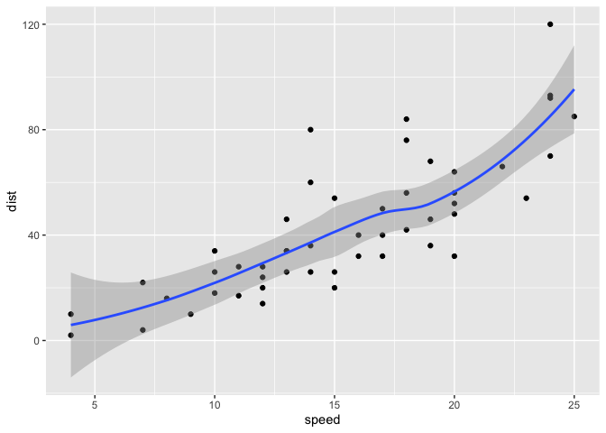
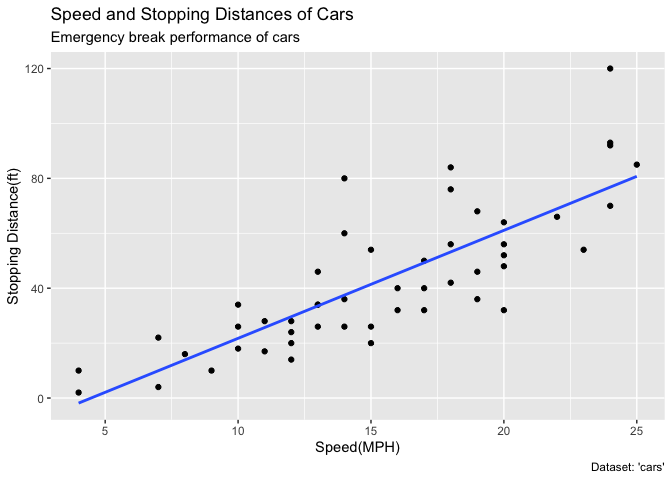
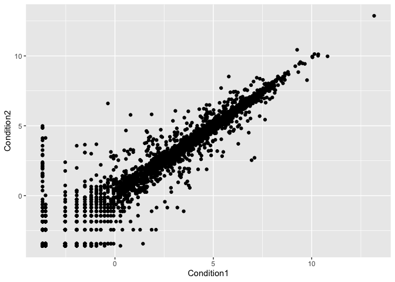
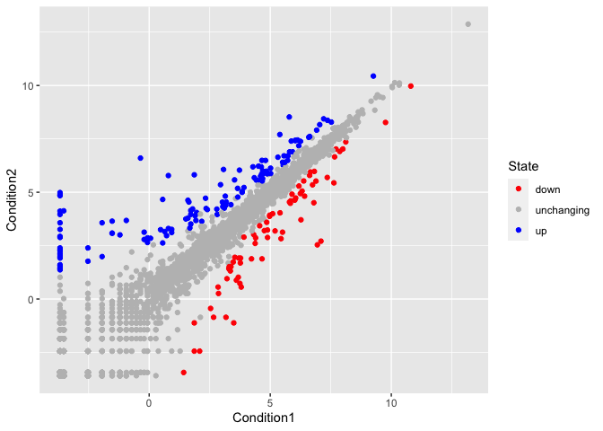
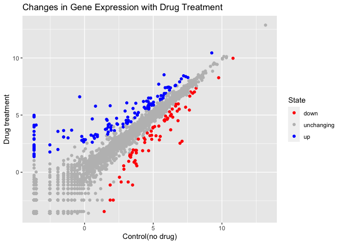

Class 05 Data Visualization
================
Groot (PID: A15485151)
12/3/2021

## Class 05 Data Visualization

# Let’s start with a scatterplot

``` r
#Before we can use it, we need to load ggplot2 from library
library(ggplot2)
```

# Every ggplot has a data + aes + geoms layers

``` r
# cars --> speed vs distance to stop
ggplot(data=cars) +
  aes(x=speed,y=dist)+
  geom_point() +
  geom_smooth()
```

    ## `geom_smooth()` using method = 'loess' and formula 'y ~ x'

<!-- -->

\#Change to a linear model

``` r
p <-ggplot(data=cars) +
  aes(x=speed,y=dist)+
  geom_point() +
  geom_smooth(method="lm",se=FALSE)
```

\#Add labels

``` r
p + labs(title= "Speed and Stopping Distances of Cars",
       x="Speed(MPH)",y= "Stopping Distance(ft)",
       subtitle = "Emergency break performance of cars",
       caption = "Dataset: 'cars'")
```

    ## `geom_smooth()` using formula 'y ~ x'

<!-- -->

\#Base graphics is shorter

``` r
plot(cars)
```

<!-- -->

\#Gene Differential Expression Data ()

``` r
url <- "https://bioboot.github.io/bimm143_S20/class-material/up_down_expression.txt"
genes <- read.delim(url)
head(genes)
```

    ##         Gene Condition1 Condition2      State
    ## 1      A4GNT -3.6808610 -3.4401355 unchanging
    ## 2       AAAS  4.5479580  4.3864126 unchanging
    ## 3      AASDH  3.7190695  3.4787276 unchanging
    ## 4       AATF  5.0784720  5.0151916 unchanging
    ## 5       AATK  0.4711421  0.5598642 unchanging
    ## 6 AB015752.4 -3.6808610 -3.5921390 unchanging

\#Number of rows?

``` r
nrow(genes)
```

    ## [1] 5196

\#Column names?

``` r
colnames(genes)
```

    ## [1] "Gene"       "Condition1" "Condition2" "State"

\#Number of columns?

``` r
ncol(genes)
```

    ## [1] 4

\#Use table function on “State” of genes data.frame

``` r
table(genes["State"])
```

    ## 
    ##       down unchanging         up 
    ##         72       4997        127

``` r
#Or
table(genes$State)
```

    ## 
    ##       down unchanging         up 
    ##         72       4997        127

\#Percent of total genes up or down regulated(signif = 2)

``` r
round(table(genes$State)/nrow(genes)*100,2)
```

    ## 
    ##       down unchanging         up 
    ##       1.39      96.17       2.44

\#Plot genes

``` r
ggplot(genes)+
  aes(Condition1,Condition2)+
  geom_point()
```

<!-- -->

\#Add color to State

``` r
z <- ggplot(genes)+
  aes(Condition1,Condition2,col=State)+
  geom_point()
```

\#Specify color scale

``` r
z+scale_color_manual(values=c("red","gray","blue"))
```

<!-- -->

\#Add labels

``` r
z+scale_color_manual(values=c("red","gray","blue"))+
  labs(title = "Changes in Gene Expression with Drug Treatment",
            x="Control(no drug)",y="Drug treatment")
```

<!-- -->

\#Install and load “gapminder” (economic&demographic dataset)

``` r
#install.packages("gapminder")
library(gapminder)
```

\#Install and load “dplyr”

``` r
#install.packages("dplyr")
library(dplyr)
```

    ## 
    ## Attaching package: 'dplyr'

    ## The following objects are masked from 'package:stats':
    ## 
    ##     filter, lag

    ## The following objects are masked from 'package:base':
    ## 
    ##     intersect, setdiff, setequal, union
