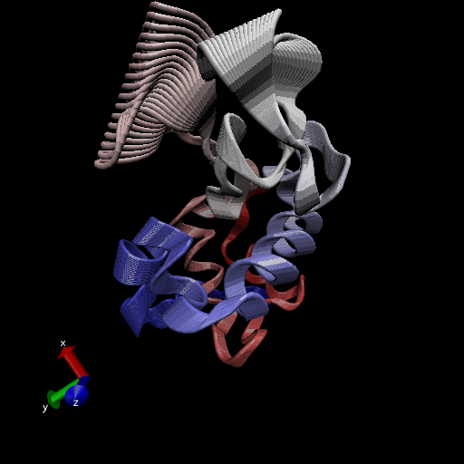
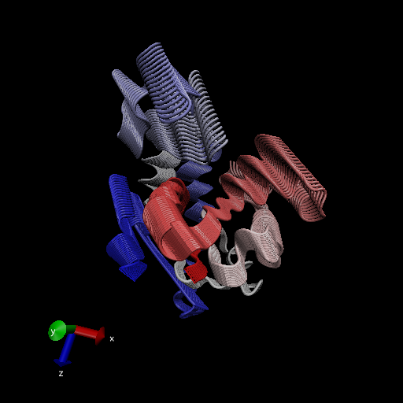

# Comparative analysis of protein structures

Using the bio3d package.
```{r}
library(bio3d)

pdb <- read.pdb("1hel")
pdb
```

> Q7: How many amino acid residues are there in this pdb object? 

**129** amino acid residues

> Q8: Name one of the two non-protein residues? 

H20

> Q9: How many protein chains are in this structure? 

**One** chain

# 4. Comparative structure analysis of Adenylate Kinase

```{r}
# Install packages in the R console not your Rmd

#install.packages("devtools")

#BiocManager::install("msa")
#devtools::install_bitbucket("Grantlab/bio3d-view")
```

> Q10. Which of the packages above is found only on BioConductor and not CRAN?

**msa**

> Q11. Which of the above packages is not found on BioConductor or CRAN?

**Grantlab/bio3d-view**

> Q12. True or False? Functions from the devtools package can be used to install packages from GitHub and BitBucket?

**TRUE**

> Q13. How many amino acids are in this sequence, i.e. how long is this sequence? 

**214** amino acids

Let's use a bioinformatics method called NMA (Normal Mode Analysis) to predict the dynamics (flexibility) of this enzyme.

```{r}
modes <- nma(pdb)
plot(modes)
```

Make a "movie" of its predicted motion. We often call this a "trajectory."
```{r}
mktrj(modes, file="nma.pdb")
```



# Analysis of ADK

```{r}
aa <- get.seq("1ake_A")
aa
```
```{r}
# Run BLAST from R
#blast <- blast.pdb(aa)
```

```{r}
#hits <- plot(blast)
```

```{r}
#hits$pdb.id 
```

```{r}
hits <- NULL
hits$pdb.id <- c('1AKE_A','4X8M_A','6S36_A','6RZE_A','4X8H_A','3HPR_A','1E4V_A','5EJE_A','1E4Y_A','3X2S_A','6HAP_A','6HAM_A','4K46_A','4NP6_A','3GMT_A','4PZL_A')
```

```{r}
# Download releated PDB files
files <- get.pdb(hits$pdb.id, path="pdbs", split=TRUE, gzip=TRUE)
```

Multiple structure alignment
```{r}
pdbs <- pdbaln(files, fit=TRUE)
```

```{r}
#save(files, blast, file="tmp.Rdata")
```

```{r}
# Vector containing PDB codes for figure axis
ids <- basename.pdb(pdbs$id)

# Draw schematic alignment
plot(pdbs, labels=ids)
```

# Principal component analysis

We will use the bio3d pca() function which is designed for protein structure data.
```{r}
# Perform PCA
pc.xray <- pca(pdbs)
plot(pc.xray)
```

```{r}
# Calculate RMSD
rd <- rmsd(pdbs)

# Structure-based clustering
hc.rd <- hclust(dist(rd))
grps.rd <- cutree(hc.rd, k=3)

plot(pc.xray, 1:2, col="grey50", bg=grps.rd, pch=21, cex=1)
```

Make a trajectory visualization of the motion captured by the first Principal Component
```{r}
# Visualize first principal component
pc1 <- mktrj(pc.xray, pc=1, file="pc_1.pdb")
```



# Normal Mode Analysis
```{r}
# NMA of all structures
modes <- nma(pdbs)

plot(modes, pdbs, col=grps.rd)
```

> Q14. What do you note about this plot? Are the black and colored lines similar or different? Where do you think they differ most and why?

The black and colored lines are similar as to where they have their peaks but they are different in their corresponding peak heights.


