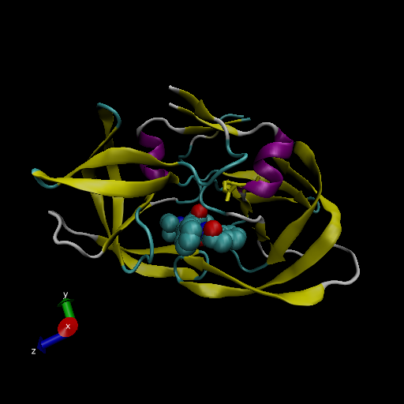

## A quick look at the PDB

```{r}
db <- read.csv("Data Export Summary.csv",row.names = 1)
head(db)
```

> Q1: What percentage of structures in the PDB are solved by X-Ray and Electron Microscopy.

```{r}
methods.sums <- colSums(db)
round((methods.sums/methods.sums["Total"])*100,2)
```

**87.55%** for X-Ray and **7.36%** for NMR

> Q2: What proportion of structures in the PDB are protein?

```{r}
round(db$Total/methods.sums["Total"]*100,2)

```

**87.36%**

> Q3: Type HIV in the PDB website search box on the home page and determine how many HIV-1 protease structures are in the current PDB?

**1828** HIV-1 protease structures

\#\#VMD structure visualization image



> Q4: Water molecules normally have 3 atoms. Why do we see just one atom per water molecule in this structure?

The Hydrogen atom is too small to be seen through x-ray crystallography

> Q5: There is a conserved water molecule in the binding site. Can you identify this water molecule? What residue number does this water molecule have (see note below)?

residue number MK1902:04

# Using Bio3d

I need to load library

```{r}
library(bio3d)
pdb <- read.pdb("1hsg")
pdb
```

