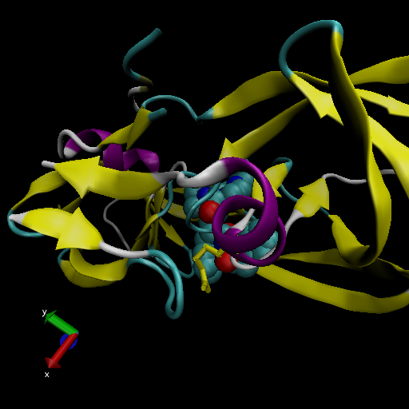

class11
================

## A quick look at the PDB

``` r
db <- read.csv("Data Export Summary.csv",row.names = 1)
head(db)
```

    ##                          X.ray   NMR   EM Multiple.methods Neutron Other  Total
    ## Protein (only)          142303 11804 5999              177      70    32 160385
    ## Protein/Oligosaccharide   8414    31  979                5       0     0   9429
    ## Protein/NA                7491   274 1986                3       0     0   9754
    ## Nucleic acid (only)       2368  1372   60                8       2     1   3811
    ## Other                      149    31    3                0       0     0    183
    ## Oligosaccharide (only)      11     6    0                1       0     4     22

> Q1: What percentage of structures in the PDB are solved by X-Ray and
> Electron Microscopy.

``` r
methods.sums <- colSums(db)
round((methods.sums/methods.sums["Total"])*100,2)
```

    ##            X.ray              NMR               EM Multiple.methods 
    ##            87.55             7.36             4.92             0.11 
    ##          Neutron            Other            Total 
    ##             0.04             0.02           100.00

**87.55%** for X-Ray and **7.36%** for NMR

> Q2: What proportion of structures in the PDB are protein?

``` r
round(db$Total/methods.sums["Total"]*100,2)
```

    ## [1] 87.36  5.14  5.31  2.08  0.10  0.01

**87.36%**

> Q3: Type HIV in the PDB website search box on the home page and
> determine how many HIV-1 protease structures are in the current PDB?

**1828** HIV-1 protease structures

\#\#VMD structure visualization image



Q4: Water molecules normally have 3 atoms. Why do we see just one atom
per water molecule in this structure?

The Hydrogen atom is too small to be seen through x-ray crystallography

> Q5: There is a conserved water molecule in the binding site. Can you
> identify this water molecule? What residue number does this water
> molecule have (see note below)?

residue number MK1902:04

# Using Bio3d

I need to load library

``` r
library(bio3d)
pdb <- read.pdb("1hsg")
```

    ##   Note: Accessing on-line PDB file

``` r
pdb
```

    ## 
    ##  Call:  read.pdb(file = "1hsg")
    ## 
    ##    Total Models#: 1
    ##      Total Atoms#: 1686,  XYZs#: 5058  Chains#: 2  (values: A B)
    ## 
    ##      Protein Atoms#: 1514  (residues/Calpha atoms#: 198)
    ##      Nucleic acid Atoms#: 0  (residues/phosphate atoms#: 0)
    ## 
    ##      Non-protein/nucleic Atoms#: 172  (residues: 128)
    ##      Non-protein/nucleic resid values: [ HOH (127), MK1 (1) ]
    ## 
    ##    Protein sequence:
    ##       PQITLWQRPLVTIKIGGQLKEALLDTGADDTVLEEMSLPGRWKPKMIGGIGGFIKVRQYD
    ##       QILIEICGHKAIGTVLVGPTPVNIIGRNLLTQIGCTLNFPQITLWQRPLVTIKIGGQLKE
    ##       ALLDTGADDTVLEEMSLPGRWKPKMIGGIGGFIKVRQYDQILIEICGHKAIGTVLVGPTP
    ##       VNIIGRNLLTQIGCTLNF
    ## 
    ## + attr: atom, xyz, seqres, helix, sheet,
    ##         calpha, remark, call
